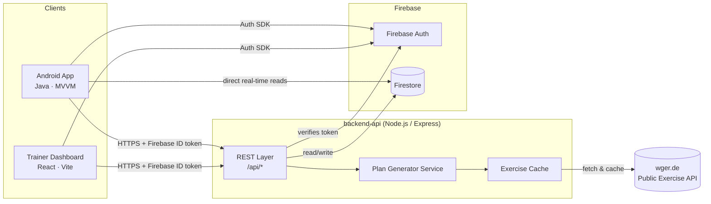

# 🏋️ GymNaughy

**Personalized workout planning for Android — powered by a Java client, a Node.js API, a React trainer dashboard, and Firebase.**

> Generate a training plan that matches your fitness level and the equipment you actually have, track every session you complete, and let your trainer follow your progress from a web dashboard.

[](#)
[](#)
[](#)
[](#)
[](#)
[](LICENSE)

---

## 📖 Overview

GymNaughy is a full‑stack fitness product built to show what a real, end‑to‑end mobile product looks like — not just an app, but the API and the operator tooling around it:

| Layer | What it does | Stack |
|---|---|---|
| **`android-app/`** | The trainee-facing Android client. Onboards the user (fitness level + available equipment), renders a generated plan, runs a guided workout session, and logs completed sets. | Java, MVVM, Firebase Auth/Firestore, Retrofit |
| **`backend-api/`** | Stateless REST API that generates personalized plans, proxies/caches a third‑party exercise database, and exposes trainer-facing aggregation endpoints. | Node.js, Express, Firebase Admin SDK |
| **`web-dashboard/`** | A trainer/admin web console: see every trainee's adherence, streak, and plan, and edit their program. | React, Vite, React Router, Recharts |

All three talk through the **same versioned REST API**, and all three share the same domain model (`User`, `Exercise`, `WorkoutPlan`, `WorkoutLog`) — the same shapes are documented once in [`docs/DATA_MODEL.md`](docs/DATA_MODEL.md) and implemented natively in Java, JS, and Firestore security rules.

This repo grew out of a two‑person Android project (see [Origin](#-origin--credits)) that I rebuilt and extended solo to add the API layer and the React dashboard, and to document the architecture properly.

---

## ✨ Features

**Trainee app (Android)**
- 🔐 Email/password + Google sign-in (Firebase Auth)
- 🧭 Guided onboarding: fitness level (beginner / intermediate / advanced) + available equipment (bodyweight, dumbbells, resistance bands, full gym)
- 🤖 Personalized weekly plan generated server-side from level + equipment + goal
- 📋 Day-by-day workout screen with sets, reps, rest timers, and exercise demo data
- ✅ Workout completion logging with a streak counter to keep motivation up
- 📈 Progress tab: calendar heatmap of completed sessions + volume-over-time chart
- 👤 Profile: edit fitness level / equipment, regenerate plan, sign out

**Backend API**
- Personalized plan generator (`POST /api/plans/generate`)
- Exercise catalog proxy + local cache in front of the public **wger** exercise database
- Workout log ingestion + streak calculation
- Trainer aggregation endpoints (roster, per-trainee adherence)
- Firebase ID token verification middleware shared by mobile and web clients

**Trainer dashboard (React)**
- Login with the same Firebase project as the mobile app
- Roster view with adherence %, current streak, and last workout per trainee
- Per-trainee drill-down with a workout history chart
- Plan editor to override a generated plan for a specific trainee

---

## 🏗️ Architecture



See [`docs/ARCHITECTURE.md`](docs/ARCHITECTURE.md) for the request-level sequence diagrams (onboarding → plan generation, workout completion → streak update) and the reasoning behind each decision (why Firestore is read directly by the client but written through the API, why the exercise catalog is cached, etc).

---

## 📂 Repository structure

```
GymNaughy/
├── android-app/          Java Android client (Gradle project, MVVM)
│   └── app/src/main/java/com/gymnaughy/android/
│       ├── model/         Domain models (User, Exercise, WorkoutPlan…)
│       ├── network/       Retrofit API service + DTOs + auth interceptor
│       ├── firebase/      Firebase Auth + Firestore wrappers
│       ├── repository/    Single source of truth per domain
│       ├── viewmodel/     ViewModels (LiveData) per screen
│       └── ui/            Activities / Fragments / RecyclerView adapters
├── backend-api/           Node.js / Express REST API
│   └── src/
│       ├── routes/        Express routers
│       ├── controllers/   Request handlers
│       ├── services/      Plan generation, wger integration, Firestore access
│       └── middleware/     Auth + error handling
├── web-dashboard/         React trainer dashboard (Vite)
│   └── src/
│       ├── pages/         Route-level screens
│       ├── components/    Reusable UI (charts, cards, sidebar)
│       ├── context/        Auth context
│       └── api/           Typed fetch client for backend-api
└── docs/                  Architecture, API spec, data model, setup guide
```

---

## 🔌 Tech stack

| Concern | Choice | Why |
|---|---|---|
| Mobile client | Java, AndroidX, MVVM | Matches the original team project this evolved from; explicit lifecycle handling |
| Networking | Retrofit + OkHttp | Typed REST client, interceptor for Firebase ID tokens |
| Auth | Firebase Authentication | One identity provider shared by app + dashboard, no custom password storage |
| Client-side data | Firestore | Real-time reads for progress/streak with offline cache on the app |
| API | Node.js + Express | Small, fast, easy to read for a portfolio review |
| External data | [wger.de](https://wger.de) public workout/exercise API | Free, open, no key required — real third-party API integration |
| Dashboard | React + Vite + Recharts | Fast dev loop, component-driven UI, simple charting |

---

## 🚀 Getting started

Each subproject has its own setup guide with exact commands:

- [`android-app/`](android-app) — open in Android Studio, add `google-services.json`
- [`backend-api/`](backend-api) — `npm install && npm run dev`
- [`web-dashboard/`](web-dashboard) — `npm install && npm run dev`

Full walkthrough (Firebase project creation, env vars, running all three together): [`docs/SETUP.md`](docs/SETUP.md)

---

## 📡 API summary

| Method | Endpoint | Purpose |
|---|---|---|
| `POST` | `/api/auth/session` | Verify a Firebase ID token, upsert the user profile |
| `GET`  | `/api/exercises` | List exercises (filterable by equipment/muscle), cached from wger |
| `POST` | `/api/plans/generate` | Generate a personalized `WorkoutPlan` for the caller |
| `GET`  | `/api/plans/me` | Fetch the caller's current plan |
| `POST` | `/api/workouts/log` | Log a completed workout session |
| `GET`  | `/api/workouts/history` | Get the caller's workout history + streak |
| `GET`  | `/api/trainer/roster` | Trainer: list of trainees with adherence summary |
| `GET`  | `/api/trainer/trainees/:id` | Trainer: single trainee detail + history |

Full request/response contracts: [`docs/API_SPEC.md`](docs/API_SPEC.md)

---

## 🗺️ Roadmap

- [ ] Push notifications for rest-day reminders and streak-at-risk nudges
- [ ] Wearable (Wear OS) companion for in-workout rep counting
- [ ] Social feed: trainees can see friends' completed sessions
- [ ] Trainer → trainee in-app messaging

---

## 🙌 Origin & credits

GymNaughy started as a two-person Android project built with Java and Android Studio: a workout planner that generated training plans from fitness level and available equipment, backed by Firebase and a public workout API, with a completed-workout tracker for motivation. This repository is a solo extension of that original app — the Android client was reworked into an explicit MVVM structure, and the `backend-api` and `web-dashboard` layers were added on top to turn it into a complete, documented full-stack product.

---

## 📄 License

Released under the [MIT License](LICENSE).
