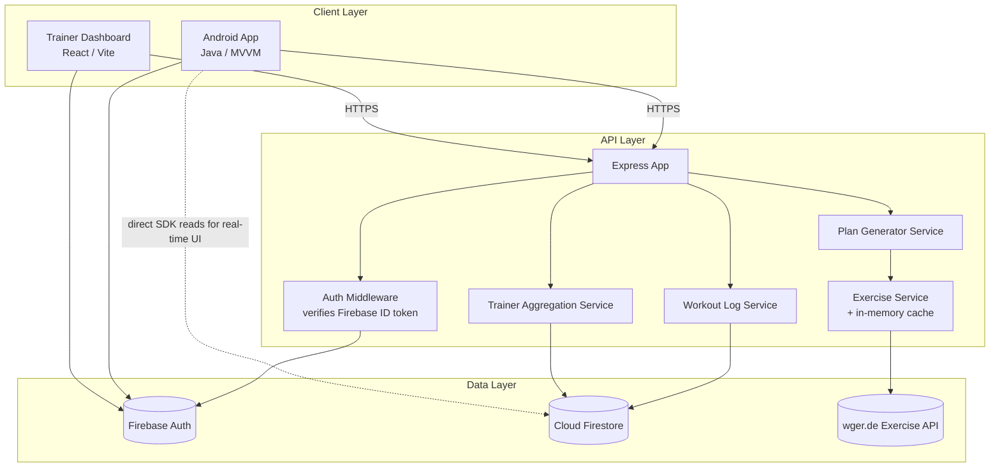
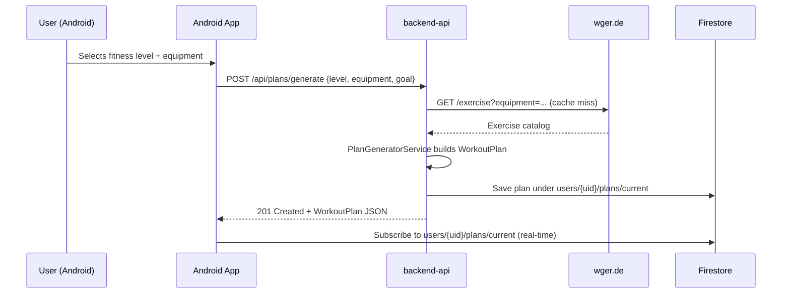
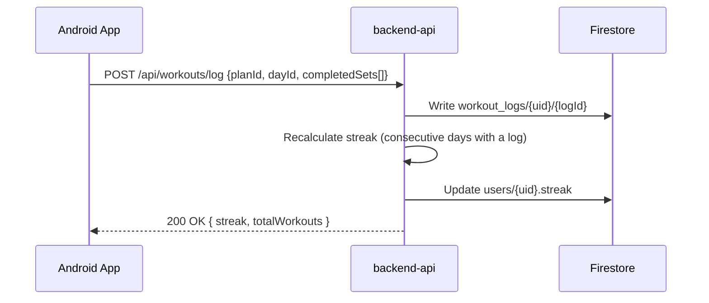
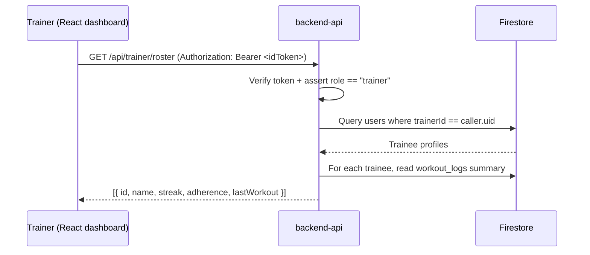

# Architecture

## 1. System overview

GymNaughy is split into three deployable units that share one backend contract:



### Why the client talks to Firestore *and* the API

- **Writes that must be validated or aggregated** (workout logs, plan generation, trainer roster reads) go through `backend-api`, so business rules live in one place instead of being duplicated in Java and JS.
- **Read-mostly, latency-sensitive UI state** (today's plan once generated, streak counter) is read directly from Firestore by the Android client via the Firebase SDK, so the dashboard/progress screens update in real time and work offline using Firestore's local cache.
- Firestore Security Rules (see `docs/DATA_MODEL.md`) restrict every direct client read to the signed-in user's own documents; anything cross-user (trainer roster) is only exposed through the API, which runs with the Firebase Admin SDK and enforces the trainer role server-side.

## 2. Key flows

### 2.1 Onboarding → personalized plan generation



### 2.2 Completing a workout



### 2.3 Trainer roster view



## 3. Android app — MVVM layering

```
UI (Activity/Fragment)  →  ViewModel (LiveData)  →  Repository  →  { Retrofit ApiService, Firestore }
```

- **ViewModels** never touch Retrofit or Firestore directly — they only see a `Repository` interface, so the data source can be swapped (e.g. for tests) without touching UI code.
- **Repositories** are the single source of truth per domain (`AuthRepository`, `WorkoutRepository`, `UserRepository`) and decide whether a read goes to the network, Firestore, or a local cache.
- **AuthInterceptor** (OkHttp) attaches the current Firebase ID token to every request to `backend-api`, so the API can verify identity without a custom session/cookie mechanism.

## 4. Backend design decisions

- **Express over a full framework (Nest/etc.)**: the API surface is small (8 endpoints); a minimal framework keeps the code readable for a portfolio reviewer.
- **In-memory TTL cache in front of wger.de**: the external API is public and rate-limited-by-courtesy; caching exercise catalogs by equipment filter for 6 hours avoids hammering a third party and keeps plan generation fast.
- **Plan generation is deterministic given (level, equipment, goal, seed)**: this makes it unit-testable without mocking randomness.
- **Firebase Admin SDK is the only thing with write access to cross-user data** (trainer aggregation); the Android/React clients never query across users directly, which is enforced twice — once by Firestore Security Rules, once by the API layer.

## 5. React dashboard design decisions

- **Same Firebase project as the Android app** — a trainer logs in with the same identity system, and their custom claim `role: "trainer"` is what the API checks before returning roster data.
- **Vite + plain fetch client** (`src/api/client.js`) instead of a heavier data-fetching library, to keep the dependency surface small for a portfolio piece while still demonstrating clean separation between API access and components.
- **Recharts** for the adherence/volume charts — small API surface, good enough for a dashboard of this scope.
